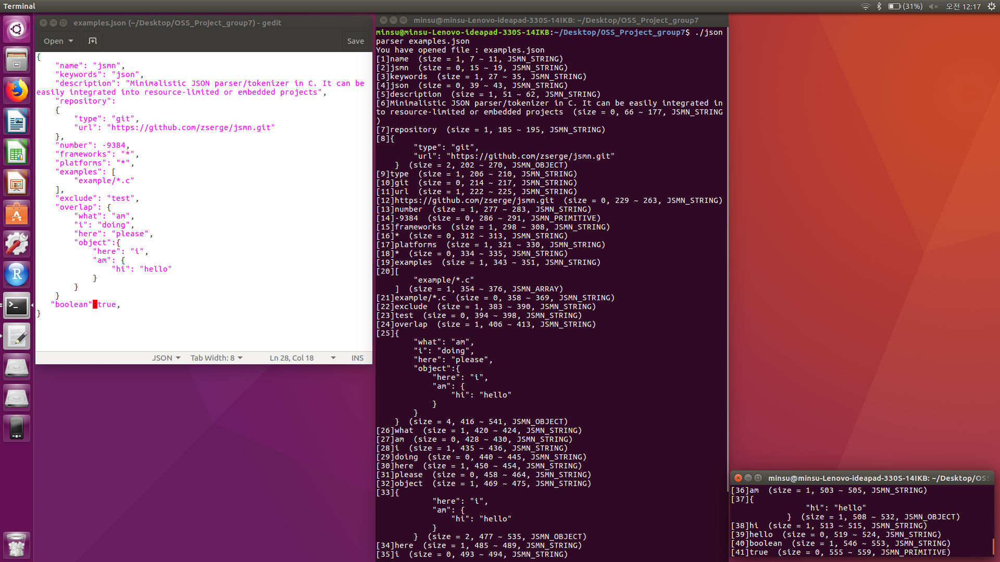

# JSON Parser in C

This project enables users to parse their text file into a JSON tet form, allowing users access to an easier & efficient way to translate their data.

## Motivation

To provide access to multiple forms of data from one (!) text file.

## List of Included Files

1) jsonparser.c  //code file
2) jsonparser    //executable file
3) examples.json // example text file
4) LICENSE.md    // LICENSE file for JSON Parser file
5) README.md
6) result.png    // screenshot of example

## Getting Started

### Dependencies

-Windows 10
-IOS 11
-Ubuntu 16.04 lts

### Executing Program

$gcc -g jsonparcer-c -o jsonparser 
 // compiles the code file into object file
 
 $./jsonparser filename
 //executes file
 
 ex) $./jsonparser examples.json

### Screenshot of Execution

## Authors

21700062 Gil Minsoo
21800446 Oh Inhyuk
21800227 Nho EunSol
## Acknowledgements

We would like to acknowledge our Professor for allowing our team members to take the extra leap and create this program. 

## License

MIT License
